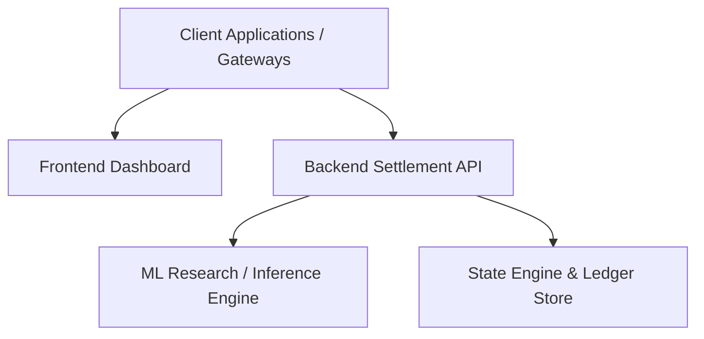
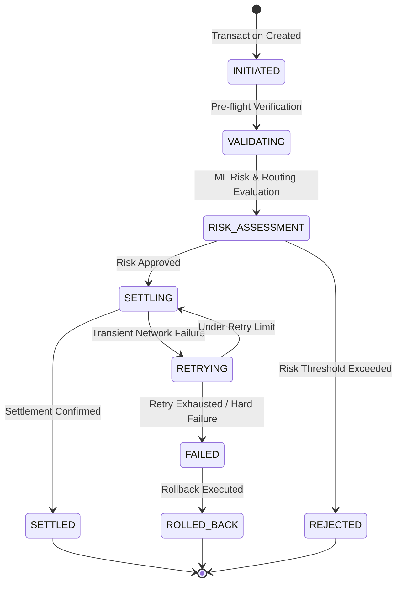

# ACTSE (Adaptive Controlled Transaction Settlement Engine)

An intelligent, resilient, and adaptive transaction settlement platform engineered for high-throughput, low-latency financial and digital asset operations.

---

## 📌 Problem Statement

<!-- 
Describe the transaction settlement challenges ACTSE addresses:
- Bottlenecks in high-volume transaction routing and clearance
- High settlement failure rates and volatility risks
- Inflexible static rule engines unable to adapt to dynamic network conditions
- Fragmented ledger consistency across distributed financial nodes
-->

*TODO: Add detailed problem context, failure mode analysis, and business impact.*

---

## 💡 The ACTSE Solution

<!-- 
Explain how ACTSE solves these challenges:
- Real-time adaptive risk assessment and dynamic routing
- Controlled, idempotent transaction life-cycle execution
- Fault-tolerant consensus and state verification
- ML-driven latency and failure prediction
-->

*TODO: Detail key value propositions, core mechanisms, and technical innovations.*

---

## 🏛 System Architecture

<!-- 
Provide an overview of the system architecture, component boundaries, and data flow.
-->



### Component Boundaries
- **`ml_research/`**: Predictive models, training pipelines, data preprocessing, and adaptive routing algorithms.
- **`backend/`**: Settlement core service, state machine, API gateways, and database adapters.
- **`frontend/`**: Real-time telemetry, transaction inspector, operations console, and analytics dashboard.

---

## 🔄 Core State Machine

<!-- 
Define the transaction states and transitions (e.g., Initiated, Validating, Pending Settlement, Settled, Failed, Rolled Back).
-->



---

## 🚀 How to Run Locally

### Prerequisites
- Python 3.10+
- Node.js 18+ / npm or pnpm
- SQLite3 / PostgreSQL

### Setup Instructions

#### 1. Repository Setup
```bash
git clone <repository-url>
cd ACTSE
```

#### 2. ML Research Service Setup
```bash
cd ml_research
python -m venv .venv
source .venv/bin/activate  # On Windows: .venv\Scripts\activate
pip install -r requirements.txt
```

#### 3. Backend Setup
```bash
cd ../backend
python -m venv .venv
source .venv/bin/activate  # On Windows: .venv\Scripts\activate
pip install -r requirements.txt
# Run backend server
uvicorn app.main:app --reload --port 8000
```

#### 4. Frontend Setup
```bash
cd ../frontend
npm install
npm run dev
```

---

## 📄 License
This project is licensed under the MIT License - see the LICENSE file for details.
