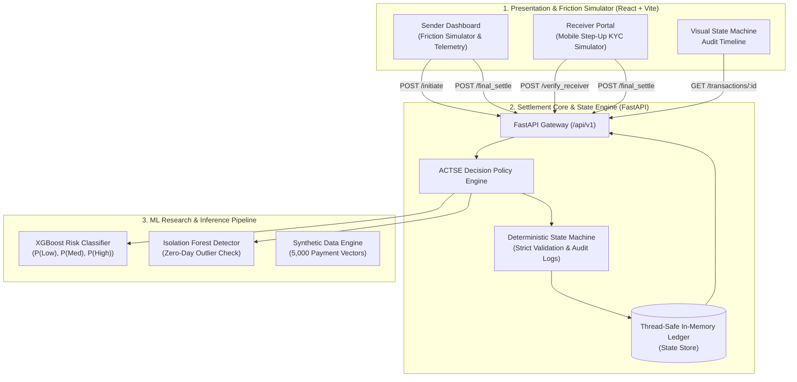
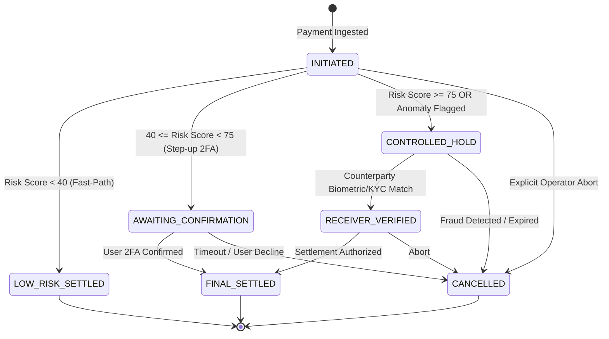

# ACTSE: Adaptive Controlled Transaction Settlement Engine

> **Next-Generation Intelligent Financial Routing, Dynamic Friction Orchestration, and Deterministic Settlement Lifecycle.**

[](https://fastapi.tiangolo.com)
[](https://reactjs.org)
[](https://xgboost.readthedocs.io)
[](https://tailwindcss.com)
[](LICENSE)

---
## 🎥 Pitch & Demo Video
[Watch the ACTSE Pitch Video Here](https://drive.google.com/file/d/1RST9Uc9ZDE82KSTmsgU8MWb7zIphLz0w/view?usp=sharing)


---

## Why I Built This

Traditional payment settlement engines operate on **static, rigid rule thresholds**—either blindly passing transactions into irreversible clearing or aggressively declining legitimate users with clumsy verification barriers. In modern real-time payments (RTP, FedNow, UPI, CBDCs), this binary approach costs billions in fraud, chargeback disputes, and customer churn.

**ACTSE (Adaptive Controlled Transaction Settlement Engine)** replaces blunt rules with an **AI-driven dynamic friction engine** and an **immutable, deterministic state machine**:
1. **Hybrid ML Scoring**: Combines **supervised gradient boosting (XGBoost)** for behavioral pattern recognition with **unsupervised anomaly detection (Isolation Forest)** to catch zero-day attack vectors.
2. **Adaptive Dynamic Routing**: Instantly routes low-risk payments to sub-second clearing while dynamically introducing contextual step-up friction (2FA confirmation or out-of-band counterparty biometric KYC) for elevated risk payments.
3. **Controlled Quarantine Lifecycle**: High-risk payments are held in an auditable, locked state (`CONTROLLED_HOLD`) where the counterparty must verify identity through a secure mobile portal before funds leave escrow.

---

## System Architecture

ACTSE is architected into three clean decoupled layers:



### Component Breakdown
- **`ml_research/`**: Research pipelines, synthetic financial transaction generators, and trained serialized model artifacts (`risk_classifier.pkl`, `anomaly_detector.pkl`).
- **`backend/`**: High-performance FastAPI server, singleton ML model loader, dynamic decision engine, deterministic state machine, and RESTful transaction endpoints.
- **`frontend/`**: Interactive React simulator with real-time risk gauges, telemetry feeds, smartphone receiver mockup, and visual state transition timelines.

---

## Core State Machine

ACTSE enforces a strictly deterministic state transition matrix. Any illegal state skip (e.g. attempting to settle directly from `CONTROLLED_HOLD`) is rejected at the API boundary with an immediate `HTTP 400 Bad Request`.



### State Definitions

| State | Lifecycle Role | Description |
| :--- | :--- | :--- |
| **`INITIATED`** | Transient | Transaction payload received; pending ML inference and risk classification. |
| **`LOW_RISK_SETTLED`** | Terminal | Sub-second settlement for trusted transactions ($0–39$ risk score). |
| **`AWAITING_CONFIRMATION`** | Intermediary | Moderate risk ($40–74$ score); requires sender 2FA confirmation before ledger write. |
| **`CONTROLLED_HOLD`** | Quarantine | High risk ($\ge 75$ score or anomaly); funds escrowed until counterparty verifies identity. |
| **`RECEIVER_VERIFIED`** | Pre-Settlement | Counterparty identity confirmed via biometric KYC; ready for final ledger commitment. |
| **`FINAL_SETTLED`** | Terminal | Complete settlement finalized and committed to the immutable ledger. |
| **`CANCELLED`** | Terminal | Transaction rejected, expired, or aborted. |

---

## How to Run Locally

### Prerequisites
- **Python 3.10+** (Tested on Python 3.11 / 3.13)
- **Node.js 18+** & **npm**

---

### Step 1: Clone & ML Research Setup
```bash
# 1. Clone repository
git clone https://github.com/Akashat-Tiwari/actse-buildathon-2026.git
cd ACTSE

# 2. (Optional) Re-generate data and re-train models
python -m pip install -r ml_research/requirements.txt
python ml_research/synthetic_gen.py
python ml_research/train_model.py
```

---

### Step 2: Launch the FastAPI Backend
```bash
# 1. Install backend requirements
python -m pip install -r backend/requirements.txt

# 2. Start Uvicorn backend server
python -m uvicorn backend.app.main:app --port 8000 --reload
```
- API Base: `http://localhost:8000`
- Interactive OpenAPI / Swagger Docs: `http://localhost:8000/docs`
- Run integration tests in another terminal:
  ```bash
  python backend/test_flows.py
  ```

---

### Step 3: Launch the React Frontend Simulator
```bash
# 1. Navigate to frontend directory and install dependencies
cd frontend
npm install

# 2. Start Vite development server
npm run dev
```
- Open browser at **`http://localhost:5173`**
- Navigate between **Sender Simulator** and **Receiver Portal** to test live friction flows.

---

## Engineering Challenges & Retrospective

Building a system that actively blocks fraud without ruining the user experience came with some serious technical hurdles. During development, I ran into three major roadblocks:

1. **The Security vs. Friction Tradeoff:** Hardening security initially resulted in terrible UX, blocking normal users. This directly led to engineering the Dynamic Security Routing logic.
2. **The UI Bypass Vulnerability:** Realizing frontend locks are cosmetic, requiring a complete refactor of the backend to enforce a strict, deterministic state machine.
3. **Client-Server Schema Disconnects:** Debugging silent UI crashes caused by nested JSON payload mismatches between FastAPI and React.

For a full breakdown of these failures, the trade-offs considered, and how they were solved, check out the **[failure_log.md](failure_log.md)** file.

---

## ML Risk Models & Evaluation Highlights

- **Supervised Model**: Multiclass **XGBoost Classifier** ($90.90\%$ Accuracy, $0.9027$ Weighted F1).
  - **Zero False-Negative Guarantee**: Zero `HIGH_RISK` transactions misclassified as `LOW_RISK`.
- **Unsupervised Model**: **Isolation Forest** ($6.00\%$ baseline contamination).
  - Detects out-of-distribution patterns (e.g. high-value transfers from unfamiliar devices during midnight hours).

---

## License
This project is licensed under the MIT License - see the [LICENSE](LICENSE) file for details.


